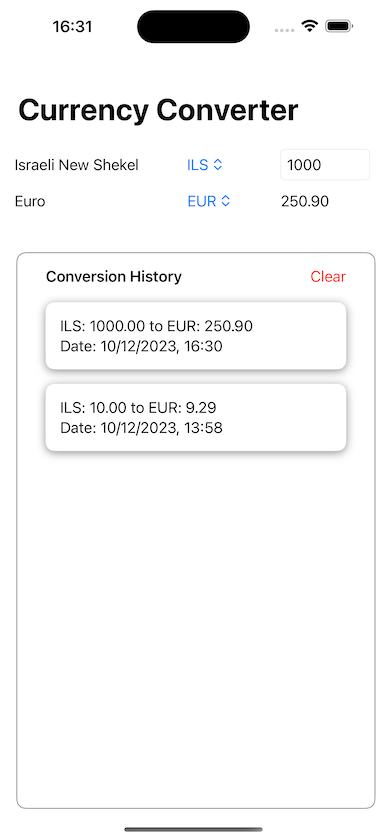

# Currency Exchange Rate Checker App

## Overview
This Currency Exchange Rate Checker App is a simple yet powerful tool that allows users to convert amounts between different currencies. It utilizes real-time data from a currency exchange rate API to provide up-to-date conversion rates. The app is built using SwiftUI and Combine, ensuring a smooth and responsive user experience.

## Features
- **API Integration**: Uses the [ExchangeRate-API](https://www.exchangerate-api.com) to fetch the latest conversion rates.
- **Currency Selection**: Allows users to select both source and target currencies from a list.
- **User Location**: Automatically preselects the source currency based on the user's current location.
- **Real-time Conversion**: Dynamically calculates and displays the converted amount as the user inputs values.
- **Error Handling**: Gracefully handles scenarios where the API is unreachable or returns errors, displaying user-friendly messages.
- **Conversion History**: Stores a history of user conversions, viewable in a list format.
- **API Caching**: Implements caching for API calls, with cache expiration set to refresh every new day.
- **Debounced History Saving**: Debounces history saving to optimize performance and reduce unnecessary writes.
- **Unit Tests**: Includes unit tests to ensure reliability and correctness of key functionalities.

## Setup and Installation
1. **Clone the Repository**:
   ```
   git clone https://github.com/yaelbe/CurrencyConverter
   ```
2. **Open the Project**:
   - Open the `.xcodeproj` file in Xcode.
3. **API Key**:
   - Obtain an API key from [ExchangeRate-API](https://www.exchangerate-api.com).
   - Insert your API key in the designated place in the app's configuration.
4. **Run the App**:
   - Select a simulator or connect a physical device.
   - Build and run the app using Xcode.

## Usage
- Select the source and target currencies from the dropdown menus.
- Enter the amount you wish to convert.
- View the converted amount displayed in real-time.
- Access your conversion history from the history tab.
- Clear the history if needed.

## Screen




